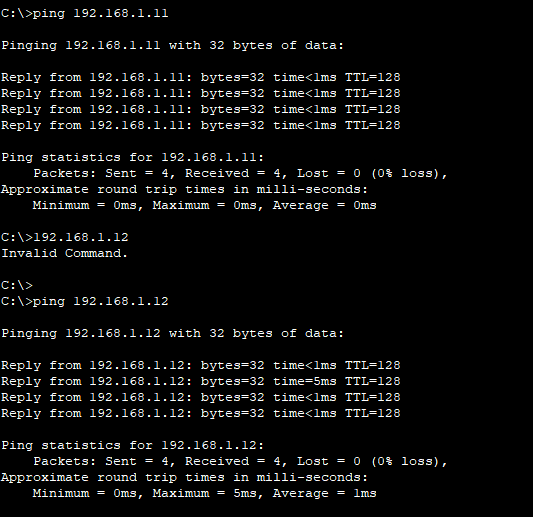
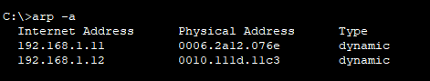

# W1 - Lab 1: Basic LAN (1 switch + 2 PC)

**Amaç:** Aynı LAN’da iki PC’yi konuşturmak; ping ve ARP gözlemi.
**Ortam:** Packet Tracer, Switch-2960, PC0, PC1, PC2

## Adımlar
1) Cihazlar bağlandı (Copper Straight-Through).
2) IP/mask atandı (gateway boş).
3) PC0 → PC1 , PC0 → PC2 `ping`
4) `arp -a` ile ARP önbelleği.

## Kanıtlar
- Ping: 
- ARP: 

## Bulgular
- Ping başarılı; ARP’de 192.168.1.11 ve 192.168.1.12↔ MAC eşleşmesi var.

## Sonuç
- Temel LAN iletişimi ve ARP gözlemi tamam.
