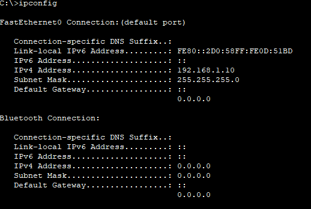
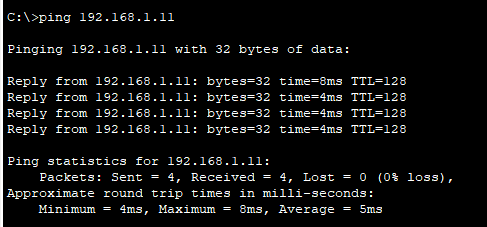
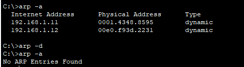
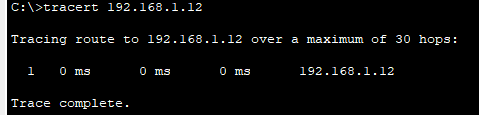
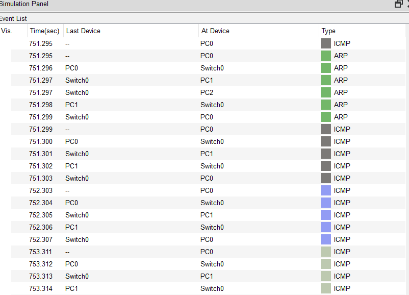

# W1 – Day 2: OSI & Command Outputs

**Goal:** OSI katmanlarını pratikle bağlamak; ipconfig/arp/ping/tracert çıktılarının neyi doğruladığını göstermek

**Setup:** PT , 2960 switch, 3×PC. IP: .10/.11/.12 (/24), gateway yok

## Evidence
- ipconfig: 
- ping:     
- arp -a:   
- tracert: 
- Simulation: 

## Findings
- İlk ping ARP cache yüzünden uzun sürdü; sonraki pingler daha hızlı
- ARP tablosunda .11 ve .12 için MAC eşleşmeleri oluştu, arp -a ile command promptda görüldü
- arp -d sonrası arp -a da MAC yok, No ARP Entries Found çıktısı.
- tracert commandda arada router olmadığı için tek hop ile PC0 PC2 ye ulaştı
- PDI ınformatoın kısmındaki OSI layersda ARP kısmında destination kısmı broad cast ve PC1 in MAC adresi gözükmüyorken,
ICMP kısmında destination kısmında PC1'in IP nin adresi ve  MAC adresi görünüyordu

## Nots
- 255.255.255.0 /24 e denk geliyor diğerlerinede baktım
- ARP atıldığında broatcast yayınlıyor switch, PC ARP sayesinde MAC i öğrendinmi unicast iletiyor
