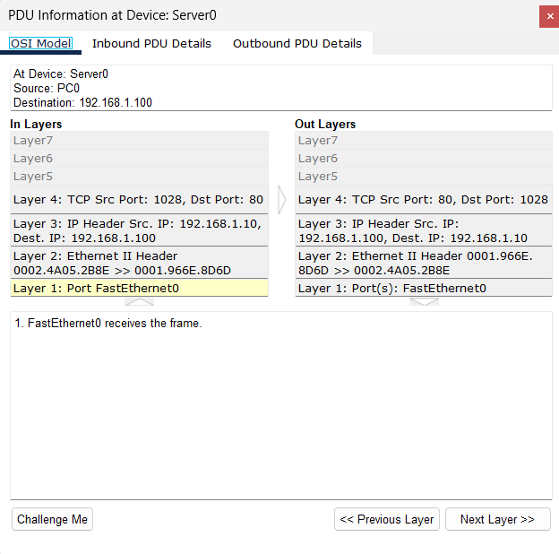
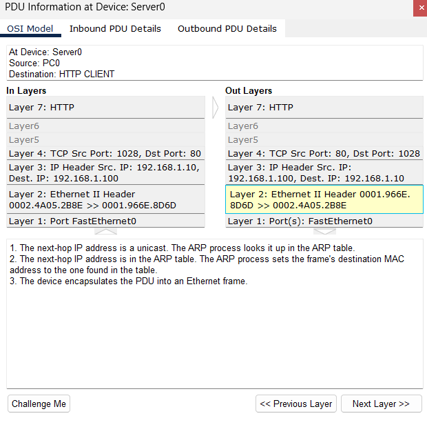

# W1 – Day 3: HTTP Journey (App → Transport → Network → Data Link)

**Goal:** HTTP isteğinin katmanlardan geçişini (encapsulation) ve TCP 3-Way Handshake’i gözlemlemek.

**Setup:** PT 8.x, 2960, PC0 (192.168.1.10/24), Server0 (192.168.1.100/24). Gateway yok. Server0 → Services → HTTP: On.

## Steps (Expected vs Observed)
1) Browser → http://192.168.1.100/
   - **Expected:** (Varsa) ARP, sonra TCP , ardından HTTP GET/200 OK.
   - **Observed:** Sıra Event List’te görüldü. 
2) TCP SYN olayına bak
   - **OSI:** L4 (TCP header), altında IP (L3) ve Ethernet (L2). 
3) HTTP GET olayına bak
   - **OSI:** L7 (HTTP), L4 (TCP dport 80, sport ephemeral), L3 (IP), L2 (Ethernet). `w1-http-get-osi.png`

## Evidence
- 
- 
- 
- 
-| SYN (0x02) | SYN/ACK (0x12) | ACK (0x10) |
|---                                                  |---                                                     |---                                                  |
|  |  |  |
## Findings
- HTTP trafiği **TCP üzerinde** çalışır: önce **3-Way Handshake (L4)**, sonra **HTTP (L7)**.
- İletim başlamadan önce aynı LAN’da **ARP (L2)** gerçekleşti.
- Kaynak port **1026**, hedef port **80** (HTTP).

## Notes / Troubleshooting
- HTTP kapalıysa (Services→HTTP Off) trafik gelmez.
- Yanlışlıkla **https** yazarsan çalışmaz (sertifika/443 yok).
- Filtrede TCP/HTTP kapalıysa Event List görünmez.
- DNS üzerinden de IP üzerinden de iletişim kurulabilir
- **3-Way Handshake** de SYN,SYN/ACK,ACK sırası izlenir,bu 3 duruumda farklı binaryler gönderilir
