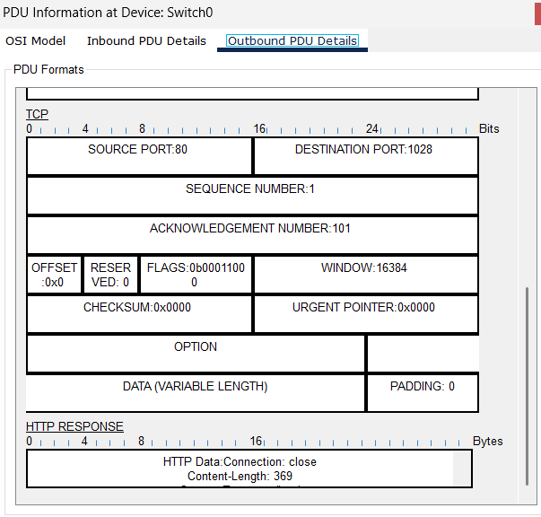

# W1 – Lab 2: Two Mini LANs (DNS → TCP → HTTP) + TCP Derinlik

**Amaç:** Aynı switch üzerinde iki ayrı /27 LAN’da **isim çözümü (DNS)** ve **HTTP erişimini** göstermek; Packet Tracer Simulation’da **ARP → DNS → TCP → HTTP** akışını, **TCP seq/ack ilerleyişi** ve **FIN/ACK kapanışı**yla birlikte kanıtlamak.

---

## 1) Topoloji & IP Planı

Tek 2960 switch, her LAN’da 1 PC + 1 Server.

| LAN | Cihaz | IP / Mask | DNS | Servis |
|---|---|---|---|---|
| Subnet A (192.168.1.0/27) | **PC0** | `192.168.1.1 / 255.255.255.224` | **192.168.1.2** | Client |
|  | **Server0** | `192.168.1.2 / 255.255.255.224` | — | **DNS=On, HTTP=On** |
| Subnet B (192.168.1.32/27) | **PC1** | `192.168.1.33 / 255.255.255.224` | **192.168.1.34** | Client |
|  | **Server1** | `192.168.1.34 / 255.255.255.224` | — | **DNS=On, HTTP=On** |

> Not: **Router yok.** Bu nedenle **A LAN ↔ B LAN** çapraz erişim **yok**; her LAN **kendi içinde** çalışacak. (Bu, beklenen davranış.)

---

## 2) DNS Kayıtları

**Server0 (A LAN):**
- **A kaydı:** `siteA.local → 192.168.1.2`
- (Opsiyonel) **CNAME:** `www.siteA.local → siteA.local`

**Server1 (B LAN):**
- **A kaydı:** `siteB.local → 192.168.1.34`
- (Opsiyonel) **CNAME:** `www.siteB.local → siteB.local`

> Alternatif olarak `localA.com` / `localB.com` isimlerini de **A kaydı** olarak ekleyebilirsin; önemli olan **PC’nin DNS alanı** kendi LAN’ındaki server’ı işaret etmeli.

---

## 3) Test Adımları (Expected vs Observed)

### 3.1 DNS
- **PC0**: `nslookup siteA.local`  
  - **Expected:** `192.168.1.2`  
  - **Observed:** ✓ (ekran görüntüsü eklendi)
- **PC1**: `nslookup siteB.local`  
  - **Expected:** `192.168.1.34`  
  - **Observed:** ✓

> “Server: UnKnown” görünmesi normal (PTR yok). Önemli olan **Name/Address** kısmı.

### 3.2 HTTP
- **PC0 → Web Browser:** `http://siteA.local` → sayfa açıldı (200 OK eşdeğeri)  
- **PC1 → Web Browser:** `http://siteB.local` → sayfa açıldı  
  - **Expected:** Event List’te **DNS Query/Response → TCP 3-way → HTTP request/response**  
  - **Observed:** ✓

### 3.3 TCP Derinlik (Simulation)
- **Sequence/Ack:** Server→PC yönünde iki ardışık TCP segmentinde **SEQ**’un, gönderilen veri uzunluğu kadar **arttığı**; karşı yönde **ACK**’ın **beklenen sonraki bayta** eşitlendiği görüldü.  
- **Kapanış:** **FIN → ACK → FIN → ACK** sırası (bayraklar: `0x11` ve `0x10`) yakalandı.  
- **PSH bayrağı:** Bu PT sürümünde **PSH görünmeyebilir**. Veri taşındığı, **HTTP REQUEST/RESPONSE** başlıkları ve **SEQ/ACK ilerleyişinden** kanıtlandı.

---

## 4) Simulation Akışı (Okuma Rehberi)

1. **ARP (Broadcast):** PC, hedef server’ın MAC’ini öğrenir. Switch, ARP Request’i tüm portlara yayar (broadcast).  
2. **DNS (Unicast, UDP/53):** `siteX.local` ismi, **kendi LAN’ındaki** DNS’e sorulur → **A kaydı** döner.  
3. **TCP 3-way:** SYN → SYN/ACK → ACK  
4. **HTTP İstek/Yanıt:**  
   - **HTTP REQUEST** (client→server) – çoğu sürüm “GET” yazısını net göstermez; **HTTP REQUEST** başlığı ve **dst port 80** yeterli kanıttır.  
   - **HTTP RESPONSE** (server→client) – **src port 80**, **Content-Length** vb. başlıklar görünür. (Bu, **200 OK**’in eşdeğeri kanıttır.)  
5. **Kapanış:** `Connection: close` başlıklarıyla akış **FIN/ACK** ile biter.

> Gürültüyü azaltmak için **Edit Filters**’ta yalnız **DNS** ve **HTTP** açık, **TCP kapalı** tutulabilir. TCP ayrıntılarına bakarken tam tersi yapılır.

---

## 5) Kanıt Görselleri (diagrams/)

Aşağıdaki dosyaları **diagrams/** klasörüne koyup bu raporda referansladım:

- **DNS kayıt ekranları:**
  - `w1-lab2-dnsA-add.png` (Server0 DNS kayıt listesi)
  - `w1-lab2-dnsB-add.png` (Server1 DNS kayıt listesi)
- **nslookup çıktıları:**
  - `w1-lab2-nslookupA.png` (PC0 → siteA.local)
  - `w1-lab2-nslookupB.png` (PC1 → siteB.local)
- **Tarayıcı ekranları:**
  - `w1-lab2-httpA-browser.png` (PC0)
  - `w1-lab2-httpB-browser.png` (PC1)
- **Simulation – akış:**
  - `w1-lab2-events-lanA.png` (DNS → TCP → HTTP zinciri)
- **HTTP PDU detayları:**
  - `w1-lab2-http-request-details.png` (client→server; dst port 80)
  - `w1-lab2-http-response-details.png` (server→client; src port 80, Content-Length)
- **TCP kapanış ve seq/ack:**
  - `w1-lab2-tcp-fin-ack.png` (Flags = 0x11 / 0x10)
  - `w1-lab2-tcp-seq-ack-1.png` & `w1-lab2-tcp-seq-ack-2.png` (ardışık segmentler)

> **PT projesi:** `labs/w1-lab2-two-mini-lans.pkt` (rapor altından linkli)

**Rapor içi gömülü:**

-dnsB yi kaydetmedim(ihtiyaç duymadım)

  
  

-nsB yi kaydetmedim

  
  

---

## 6) Bulgular (Findings)

- **DNS adres defteridir:** Alan adını **doğru IP’ye** eşlemezsen isimle erişim başarısız olur; IP ile direkt erişim çalışabilir.  
- **ARP vs DNS:** ARP, **L2 MAC** bulmak için **broadcast**; DNS, **isim→IP** için **unicast** (UDP/53).  
- **Aynı subnet** içinde **router gerekmez** (Switch + ARP yeter). **Farklı subnet** için **gateway** gereklidir (bu labda yok).  
- **HTTP 200 OK kanıtı:** Bazı PT sürümleri “200 OK” yazısını düz göstermese de **HTTP RESPONSE başlığı + tarayıcının açılması + seq/ack ilerleyişi** yeterli kanıttır.  
- **TCP seq/ack** düzenli artar; **kapanış** FIN/ACK ile yapılır. **PSH** bayrağı bu sürümde görünmeyebilir.

---

## 7) Sorun/Giderme (Troubleshooting)

- **İsim çözülmüyor:** PC’nin **DNS Server** alanı **kendi LAN’ındaki** server’ı göstermeli (PC0→192.168.1.2, PC1→192.168.1.34).  
- **Sayfa açılmıyor:** Server’da **HTTP=On**. URL **http** olmalı (https değil).  
- **Event List çok kalabalık:** **Edit Filters** ile sadece gerekli protokolleri aç.  
- **nslookup “NXDOMAIN”:** Yanlış isim (ör. `localA.com`) veya kayıt eklenmemiş olabilir. DNS ekranından kontrol et.

---

## 8) Dosyalar

- PT Projesi: [`labs/w1-lab2-two-mini-lans.pkt`](../labs/w1-lab2-two-mini-lans.pkt)
- Kanıt Görselleri: `diagrams/…`
- Bu rapor: `reports/w1-lab2-dns-http-tcp.md`

---

## 9) Ek – Hızlı Teori Kutucukları

**DNS neden UDP?**  
Hafif/sor–cevap modeli; **UDP/53** ile hızlıdır. Cevap büyükse veya zone transferi yapılacaksa **TCP** kullanılabilir.

**TCP Sequence / Ack**  
SEQ = paketteki ilk baytın numarası; **ACK = beklenen sonraki bayt**. Veri geldikçe ACK artar.  
Kapanış: **FIN → ACK → FIN → ACK**. **RST** aniden koparır.

**ARP vs DNS**  
ARP: **L2** için MAC çözümü (**broadcast**). DNS: **L7/L4**’te isim→IP (**unicast**).  
