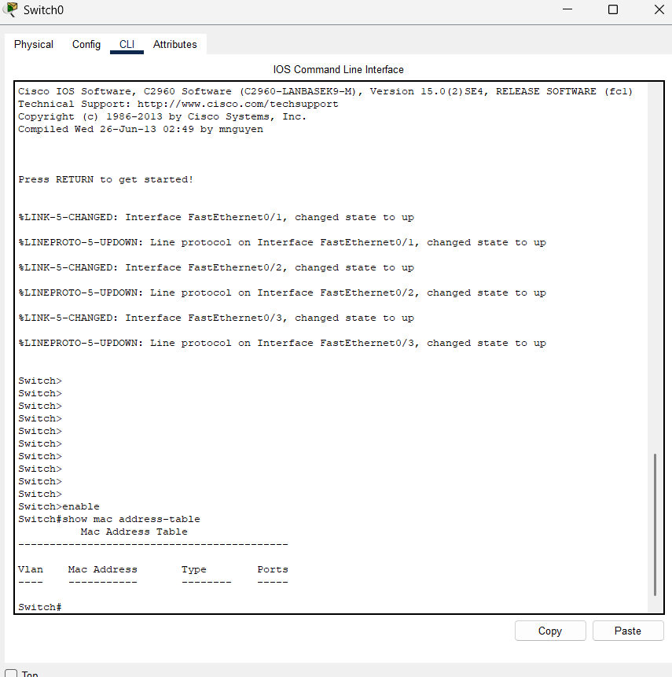
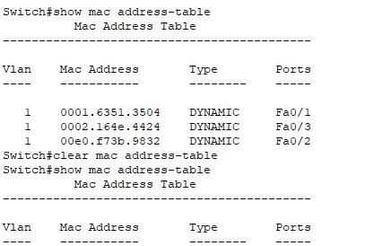
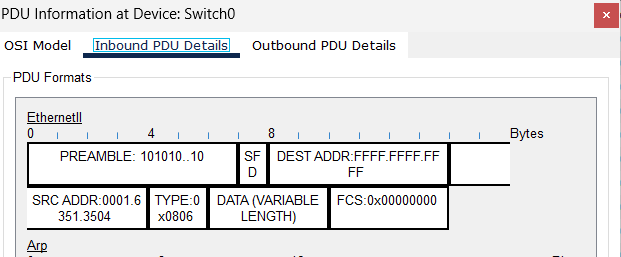
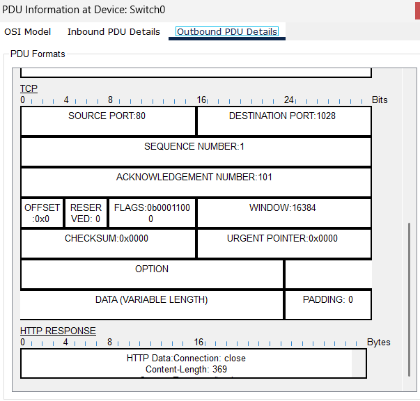
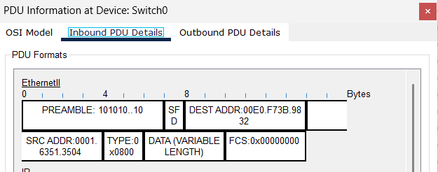
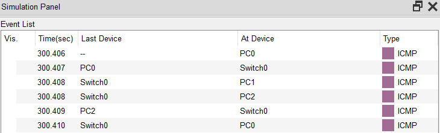

# W2-D1 — MAC Address • Ethernet Frame • Switch CAM

**Goal (Amaç):** Ethernet çerçevesi (frame) alanlarını öğrenmek; switch CAM (Content-Addressable Memory) tablosunda **öğrenme (learning)** ve **iletme (forwarding)** davranışını gözlemlemek; değişken durumlarda (ARP önbelleği dolu/boş, CAM dolu/boş) farkları anlamak.

---

## Setup (Kurulum)

- **Topoloji:** 1× Cisco 2960 (VLAN 1), 3× PC (aynı subnet)
- **Örnek IP planı:**
  - PC0 `192.168.1.10/24` • PC1 `192.168.1.11/24` • PC2 `192.168.1.12/24`
- **Kablolar:** Copper Straight-Through
- **Switch komutları (referans):**

## Steps (Adımlar)

1. **PC’lere IP ver** ve birbirini **ping**leyebildiklerini doğrula.

2. **CAM tablosunu temizle** (learning’i net görmek için):

3. **PC0 → PC1 ping at** ve ardından CAM’i kontrol et:

**Beklenen:** Switch, kaynak MAC’i gördüğü portta öğrenir (**Learn**).  
Hedef MAC bilinmiyorsa ilk çerçeve **unknown unicast flood** olabilir (aşağıdaki *Notlar*’a bak).

4. **Simulation (PT)** ya da **SPAN** (gerçek switch, opsiyonel) ile akışı izle.  
- **ARP isteğinde**: `Destination MAC = ff:ff:ff:ff:ff:ff (broadcast)`  
- **ICMP/TCP/UDP trafiğinde**: **unicast** (Destination MAC = hedef PC’nin MAC’i)

5. **PDU/Frame detayını not et:**
- **ARP çerçevesinde** `EtherType = 0x0806`
- **IPv4 (ICMP dâhil) çerçevesinde** `EtherType = 0x0800`

## Evidence (Kanıtlar)

- `show mac address-table` ekran görüntüsü (1,2)
- **ARP broadcast** request ve response, **Unicast ICMP** PDU detayları(3,4,5)
- **unknown unicast flood** gözlemi(6)

-
-
-
-
-
-

## Findings (Bulgular)

### 1) CAM öğrenmesi (learning) davranışı
- Switch, her gelen çerçevenin **source MAC**’ini, **geldiği fiziksel port** ile eşleyerek CAM tablosuna yazar.  
- **Destination MAC** CAM’de kayıtlıysa → çerçeve yalnızca o porta **forward** edilir (**unicast**).  
- **Destination MAC** CAM’de yoksa → ilk çerçeve **unknown unicast flood** olarak birçok porta gönderilir (yayın benzeri görünür). **Cevap** geldiğinde switch hedefin **destination MAC**’ini öğrenir ve sonraki çerçeveler **unicast** devam eder.  
- **Not:** Flood etmek **broadcast** göndermek değildir; ama birden çok porta gittiği için Packet Tracer’da “yayılıyor” gibi görünür.

### 2) ARP vs ICMP’de EtherType
- **ARP çerçevesi:** `EtherType = 0x0806`  
- **IPv4/ICMP çerçevesi:** `EtherType = 0x0800`

### 3) Broadcast vs Unicast adresleme
- **Broadcast:** `ff:ff:ff:ff:ff:ff` (herkese yayım — ARP istekleri gibi)  
- **Unicast:** hedef cihazın **benzersiz MAC’i**

> **Senaryonun olası açıklaması:**  
> CAM’i temizledikten sonra **host’un ARP önbelleği** hâlâ hedefin MAC’ini biliyorsa, host **unicast** frame (ARP göndermez) gönderir; fakat **switch** hedef MAC’in **hangi portta** olduğunu henüz öğrenmediği için **unknown unicast flood** yapabilir. **Cevap** paketinde hedefin **source MAC’i** görülür ve CAM güncellenir; takip eden ICMP’ler **unicast** olur.

---

## Notes (Notlar)

### Çerçeve Alanları Tablosu

| TR (Alan)            | EN (Field)          | Boyut | Not                                   |
|----------------------|---------------------|:-----:|----------------------------------------|
| Hedef MAC            | Destination MAC     |  6 B  | `ff:ff:ff:ff:ff:ff` = broadcast        |
| Kaynak MAC           | Source MAC          |  6 B  |                                        |
| 802.1Q etiket (ops.) | 802.1Q tag          |  4/8 B | VLAN                                   |
| Tür/Uzunluk          | EtherType/Length    |  2 B  | `0x0800` IPv4, `0x0806` ARP            |
| Taşıma yükü          | Payload             | 46–1500 B | L3 paket (IP)                         |
| FCS                  | FCS                 |  4 B  | CRC                                    |

> **PDU isimleri (katmana göre):**  
> **L4:** segment (TCP) / datagram (UDP) • **L3:** packet (IP) • **L2:** frame (Ethernet) • **L1:** bits

## DoD (Definition of Done)

- [ ] Çerçeve alanları şeması ve tablo eklendi  
- [ ] `show mac address-table` önce/sonra ekran görüntüleri eklendi  
- [ ] ARP broadcast ve unicast ICMP akışlarından en az 1 görüntü eklendi  
- [ ] (Ops.) İlk pakette **unknown unicast flood** notu ve açıklaması yazıldı  
- [ ] Tekrar adımları/komutlar kısaca listelendi

---

      
