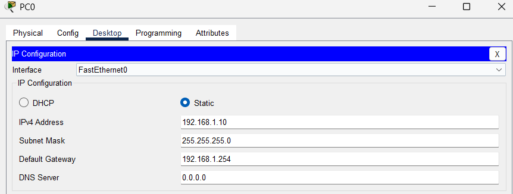
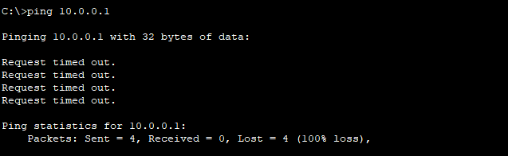
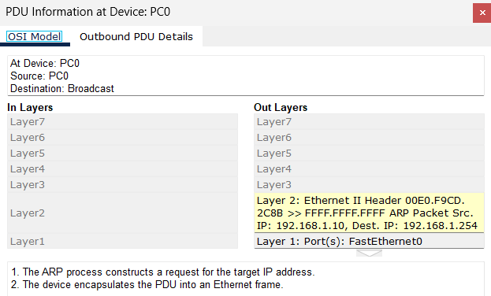
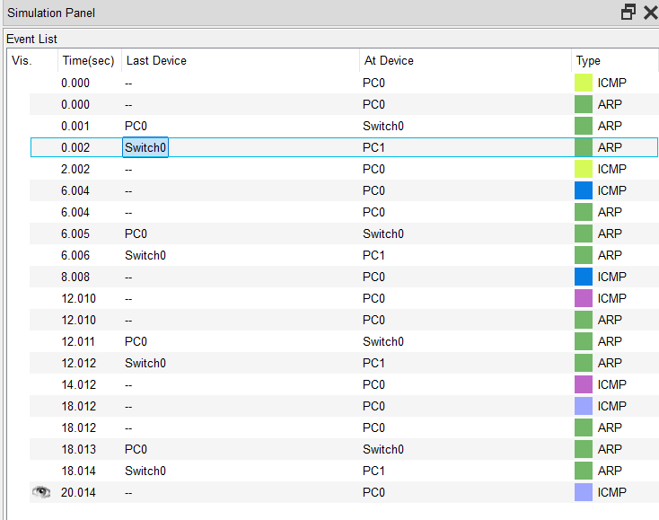
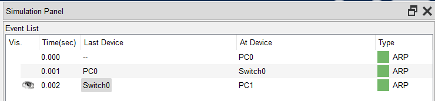
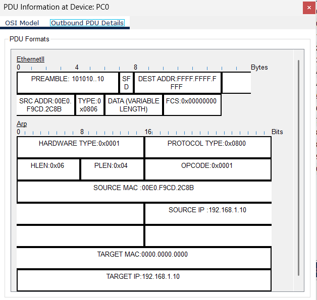

# W2 — ARP & ICMP (Hatalı Gateway Senaryosu)

1)
**Goal:** ARP akışını (Who-has / Is-at) gözlemlemek ve hatalı default gateway nedeniyle off-subnet ping’in neden başarısız olduğunu kanıtlamak.
**Setup**
- PC0: 192.168.1.10/24, **GW: 192.168.1.254 (yanlış)**
- PC1: 192.168.1.20/24
- Switch: 2960, copper
- **Not:** Bu senaryoda gerçek gateway cihazı yoktur (bilerek).

2) ## Adımlar (Steps)
1) PC1→PC2 ping (aynı alt ağ)  
2) `arp -a` ile PC2 için dinamik ARP kaydını doğrula  
3) PC1→10.0.0.1 ping (off-subnet)  
4) PDU Simulation’da **Who-has 192.168.1.254** yayınlarının cevapsız kaldığını izle  
5) `arp -d *` ve sonrasında tekrar aynı alt ağ ping → ARP kaydının yeniden oluştuğunu göster
6) `arp -d` sonrasında ARP yollandığını gör (G-ARP),bu ARP de source ve destination adresinin aynı olduğunu fark et

3) ## Kanıtlar (Evidence)
- PC0 a GW ataması(1)
- PC0 dan ağda bulunmayan adrese ping ve sonrasında ARP nin GW IP'si ile yapılması yani destination IP = GW IP (2,3,4)
-arp -d ile **ARP flush** ve çıktıları (5,6)

-
-
-
-
-
-
-
 
4) ## Bulgular (Findings)
- Aynı alt ağ iletişimi **GW’ye ihtiyaç duymaz**; ARP→Switch ile çalışır.  
- Off-subnet ping’de **ilk adım**: **GW’nin MAC’ini** ARP ile öğrenmek(yani destination address kısmında GW IP si yazıyor);
 **yanlış/var olmayan GW** → ARP cevabı yok → **ping başlamaz**(time out).  
- ARP tablosu **dinamiktir**; flush sonrası ilk ping tekrar ARP tetikler.
- arp -d komutu sonrası G-ARP yayımlanır ve yaynlanan ARP de source ve destination address aynıdır

5) ## Notes
-Off-subnet hedef için PC1 katman-2 çerçeveyi oluşturmak üzere **GW’nin MAC adresine** ihtiyaç duyar. 
**192.168.1.254** adresinde cihaz olmadığı için **ARP Who-has** yayınlarına **Is-at** cevabı gelmez, **çerçeve oluşmaz**, ICMP Echo gönderilemez → ping **timeout**.
-PC0 dan PC1 e olan pingdeki request ARP de opcode 0x0001 iken response ARP de 0x0002'ydi

## DoD (Definition of Done)
- [ ] Hatalı GW senaryosunda **ARP Who-has** ekran görüntüsü eklendi
- [ ] Kısa **kök-neden** analizi yazıldı
