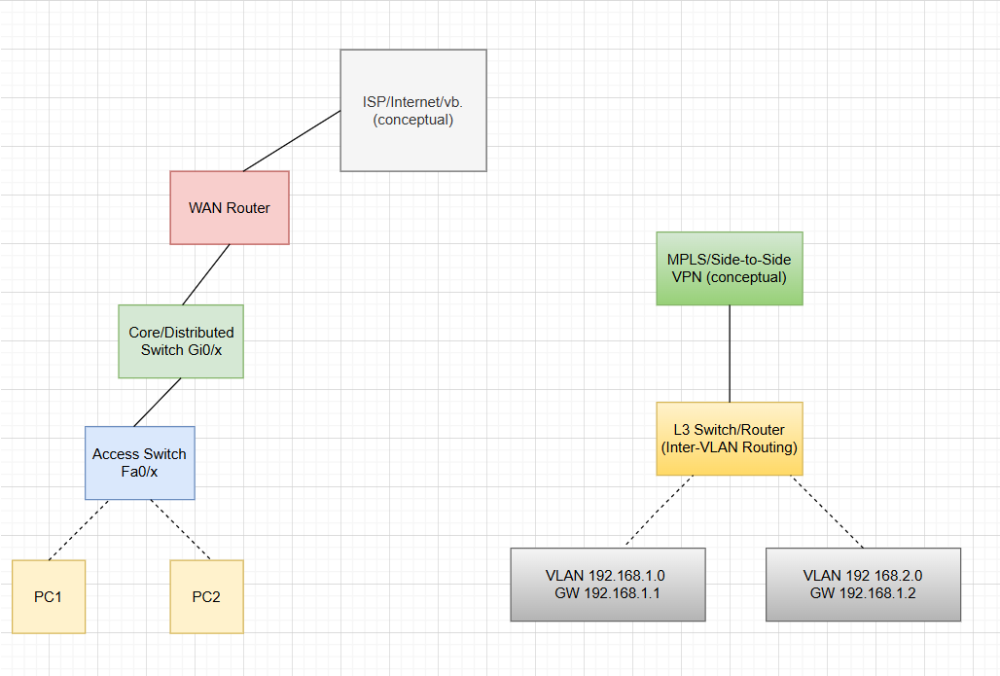

## Physical and Locigal Networks



````markdown
# VLAN • Access/Trunk/Native • Inter-VLAN Routing — **Kısa Rehber**  
*(“Nedir?” → “Ne işe yarar?” → “Nerede kullanırım?” + “Nasıl kanıtlarım?”)*

> **Zihin modeli:**  
> **VLAN (Virtual LAN)** = Switch’i mantıksal bölgelere ayırır (aynı switch üstünde birden çok “mahalle”).  
> **Access port** = Uç cihaz için tek mahalle kapısı (etiketsiz).  
> **Trunk port (802.1Q)** = Mahalle etiketini (VLAN ID) çerçeveye takıp cihazlar arası taşır.  
> **Native VLAN** = Trunk üstünde etiketsiz (untagged) giden VLAN.

---

## 1) VLAN (Virtual LAN)
**Nedir?** Switch içinde portları mantıksal gruplara ayırıp **ayrı broadcast domain**’ler oluşturur.  
**Ne işe yarar?** İzolasyon, güvenlik, sorunları/yarınları bölmek.  
**Nerede?** **Katman-2** (Ethernet).

**Bir cümlede:** “Tek switch, birden çok **ayrı L2 mahalle**.”

---

## 2) Access port (access port)
**Nedir?** Uç cihazın bağlandığı **tek VLAN’lık** port; **etiketsiz (untagged)** trafik taşır.  
**Switch ne yapar?** Bu porttan gelen/çıkan **tüm** çerçeveleri atanmış VLAN’a koyar/alır.

**Cisco (örnek):**
```text
interface fa0/2
  switchport mode access
  switchport access vlan 10
````

---

## 3) Trunk port (trunk port, 802.1Q)

**Nedir?** Switch↔Switch / Switch↔Router hatlarında **birden çok VLAN’ı** tek kablo üzerinden taşır.
**Nasıl?** Çerçeveye **802.1Q etiketi (tag)** eklenir; etiket içindeki **VID (VLAN Identifier)** hangi VLAN olduğunu belirtir.

**802.1Q etiketi**: TPID=0x8100 + TCI(PCP/DEI/**VID**).
**VID=10** → “Bu çerçeve **VLAN 10**’a ait”.

**Cisco (örnek):**

```text
interface fa0/1
  switchport mode trunk
  switchport trunk allowed vlan 10,20
```

---

## 4) Native VLAN (native VLAN)

**Nedir?** Trunk üzerinde **etiketsiz** (untagged) taşınan VLAN.
**Neden kritik?** İki uçta **aynı** native VLAN olmalı; yoksa “VLAN sızıntısı” yaşanır.
**İpucu (güvenlik):** Native’i genelde **kullanılmayan** bir VLAN’a çek.

```text
interface fa0/1
  switchport trunk native vlan 999
  switchport trunk allowed vlan 10,20
```

---

## 5) “1 VLAN = 1 IP alt ağı” (neden?)

* **VLAN ayrımı L2’de** yapılır (etiket/tag). **IP adresi gerekmeden** de VLAN’lar ayrıdır.
* **L3 (routing)** devreye girdiğinde, router **IP öneklerine göre** karar verir.
  Aynı /24’ü iki farklı VLAN arayüzüne verirsen **overlapping** olur → Cihaz izin vermez ya da belirsizlik çıkar.

**Doğru tasarım:**

```text
VLAN 10  → 192.168.10.0/24 (GW = 192.168.10.1)
VLAN 20  → 192.168.20.0/24 (GW = 192.168.20.1)
```

**Soru:** “Peki iki VLAN’da **aynı IP** kullanılabilir mi?”

* **Routing yoksa** ve tamamen izole kalacaklarsa: Evet, teknik olarak çakışma olmaz; **ama birbirleriyle konuşamazlar** (amaçsız).
* **Routing varsa**: **Hayır**, tek tablolu ağda olmaz.
* **İstisnalar (ileri seviye):**

  * **VRF (Virtual Routing and Forwarding)**: Her VLAN’ı ayrı “sanal router”a koyarsın → aynı IP’yi güvenle yeniden kullanırsın.
  * **IRB / Bridge-Domain + BVI**: VLAN’ları L2’de köprüleyip **tek yayın alanı** yaparsın (artık “ayrı VLAN” mantığı kalmaz).

---

## 6) Router L2’yi “bilir” mi?

* Router/L3-switch, **hangi L3 arayüzde** işlediğine bakarak VLAN bağlamını bilir
  (ör. `Gi0/0.10 encapsulation dot1Q 10` ya da `interface Vlan10`).
* **Karar**ı **L3 (IP)** tablosuna göre verir; L2 etiketi sadece **seçilen** çıkış arayüzünde eklenip/çıkarılır.

---

## 7) Paket Hikâyesi (gözünde canlandır)

```
PC-A (access VLAN 10) --(untagged)--> [Switch]
[Switch] --(trunk, 802.1Q VID=10)--> [L3 Switch/Router]
[L3] (IP ile karar) --(trunk, VID=20)--> [Switch] --(untagged)--> PC-B (access VLAN 20)
```

* **Access port**ta çerçeve **etiketsiz**dir.
* **Trunk**ta **etiketlidir** (VID=10/20).
* Router/L3-switch **IP**’ye bakarak “hangi VLAN’dan çıkarayım?” der ve uygun etiketi koyar.

---

## 8) Inter-VLAN Routing (3 yol)

### A) Router-on-a-Stick (RoS) — küçük/lab

```text
! Switch: trunk
interface fa0/1
  switchport mode trunk
  switchport trunk allowed vlan 10,20

! Router: alt-arayüzler
interface fa0/0
  no shut
interface fa0/0.10
  encapsulation dot1Q 10
  ip address 192.168.10.1 255.255.255.0
interface fa0/0.20
  encapsulation dot1Q 20
  ip address 192.168.20.1 255.255.255.0
```

### B) L3 Switch (SVI) — hızlı/ölçeklenir

```text
ip routing
interface vlan 10
  ip address 192.168.10.1 255.255.255.0
  no shut
interface vlan 20
  ip address 192.168.20.1 255.255.255.0
  no shut
! Uç portları access yap
interface fa0/2
  switchport mode access
  switchport access vlan 10
interface fa0/3
  switchport mode access
  switchport access vlan 20
```

### C) Ayrı fiziksel portlar (eski/usul)

Her VLAN ayrı fiziksel bağlantı ile router’a gider (güncelde tercih edilmez).

---

## 9) “Nasıl kanıtlarım?” (CLI kontrol listesi)

```text
show vlan brief            ! VLAN tanımları ve access port üyelikleri
show interfaces trunk      ! Trunk portlar, allowed/native VLAN
show interfaces switchport ! Bir port access mi trunk mı?
show mac address-table     ! MAC öğrenimi VLAN bazında
show ip route              ! L3 cihazda SVI/subinterface rotaları
ping/traceroute            ! VLAN’lar arası erişim (DG doğru mu?)
```

**Beklenen:**

* VLAN 10 ↔ VLAN 20 arası **ping** sadece **router/L3-switch** varsa olur.
* Native VLAN her iki uçta **aynı** olmalı (uyuşmazlık sızıntı yapar).

---

## 10) Sık Yapılan Hatalar & İpuçları

* **Trunk unutuldu** → VLAN etiketleri karşıya gitmez, inter-VLAN kırılır.
* **Yanlış default-gateway** → Host L3’e çıkamaz.
* **Aynı /24 iki VLAN’da** → Overlapping; tek tablolu ağda **yasak**.
* **Native VLAN uyumsuz** → Etiketsiz trafik yanlış VLAN’a düşebilir.
* **Hub/yarı-duplex** → Çakışma/CRC hataları; switch + full-duplex kullan.

---

## 11) Mini SSS

**S:** “İki VLAN’da **aynı IP** verebilir miyim?”
**C:** Routing **yoksa** verebilirsin ama birbirleriyle **konuşamazlar** (izole). Routing **varsa**, tek tablolu ağda **veremezsin**. İstisna: **VRF** (ayrı tablolar) ya da **L2 köprüleme (IRB)**.

**S:** “Tag dediğin **802.1Q** mu? **VID** ne?”
**C:** Evet. 802.1Q etiketindeki **VID (VLAN ID)** hangi VLAN’a ait olduğunu söyler (trunk üzerinde görünür). Access portta etiket **yoktur**.

---

## 12) Hızlı Terimler (TR — EN)

* **Erişim portu** (access port) — tek VLAN, etiket yok
* **Trunk port** (trunk port) — çok VLAN, 802.1Q etiketli
* **Yerel VLAN** (native VLAN) — trunk üstünde etiket **yok**
* **VLAN kimliği** (VID, VLAN ID) — 802.1Q içindeki 12 bit numara
* **SVI** (Switched Virtual Interface) — L3 switch’te VLAN’ın L3 arayüzü
* **RoS** (Router-on-a-Stick) — router’da alt-arayüz + dot1Q
* **VRF** — ayrı yönlendirme tabloları (aynı IP’leri yeniden kullanma olanağı)
* **IRB/Bridge-Domain+BVI** — VLAN’ları köprüleyip tek L2 domain yapma

---

### Tek Cümlede Özet

**Access** = uç için tek VLAN kapısı; **Trunk** = çok VLAN’ı 802.1Q ile taşır; **Native** = trunk’taki etiketiz VLAN;
**VLAN ayrımı L2’de**, **routing L3’te**; günlük kural **“1 VLAN = 1 IP alt ağı”**; aynı IP’yi tekrar kullanacaksan **VRF** gerekir.

```

::contentReference[oaicite:0]{index=0}
```
