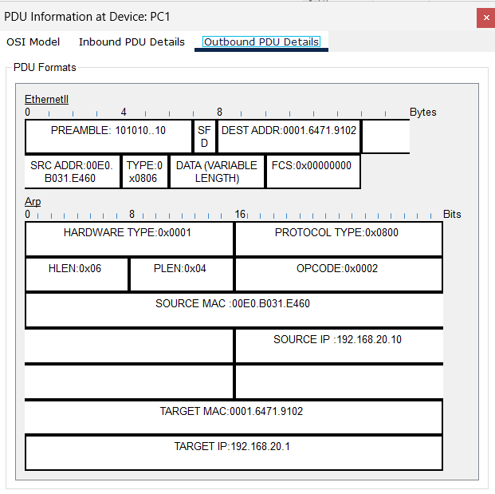
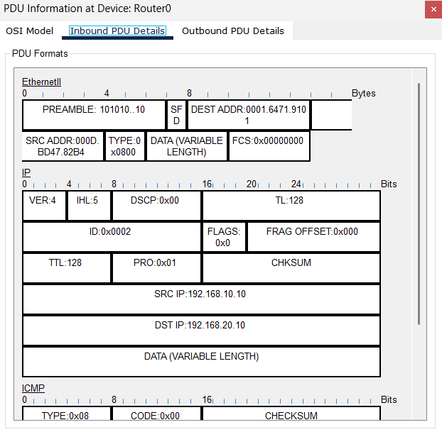

# W3 — Gün 2 · 2 LAN + 1 Router (Statik Rota tadım)


**Goal:** İki ayrı LAN’ı (192.168.10.0/24 ve 192.168.20.0/24) bir router üzerinden konuşturmak; yönlendirmeyi doğrulamak; örnek bir **default static route** (Null0) satırını route tablosunda görmek.

## 1) Topology (setup)

- **R1 (2911)** — arayüzler: **g0/0**, **g0/1**  
- **SW-A (2960)** + **PC-A** → **LAN A**  
- **SW-B (2960)** + **PC-B** → **LAN B**  
- Kablolar: **Copper Straight-Through**  
- **Fiziksel bağlantılar:**  
  - PC-A(Fa0) → SW-A(Fa0/2) → R1(G0/0)  
  - PC-B(Fa0) → SW-B(Fa0/2) → R1(G0/1)  


##  IP Planı

| Bileşen | Arayüz | IP / Prefix | Maske | Varsayılan Ağ Geçidi |
|---|---|---|---|---|
| R1 | g0/0 | 192.168.10.1/24 | 255.255.255.0 | — |
| R1 | g0/1 | 192.168.20.1/24 | 255.255.255.0 | — |
| PC-A | Fa0 | 192.168.10.10/24 | 255.255.255.0 | **192.168.10.1** |
| PC-B | Fa0 | 192.168.20.10/24 | 255.255.255.0 | **192.168.20.1** |


##  Konfigürasyon (Cisco IOS)

Router CLI:
```text
enable
conf t
!
interface g0/0
 description LAN-A
 ip address 192.168.10.1 255.255.255.0
 no shutdown
!
interface g0/1
 description LAN-B
 ip address 192.168.20.1 255.255.255.0
 no shutdown
!
! Default static route (kavram göstermek için blackhole/Null0):
ip route 0.0.0.0 0.0.0.0 Null0
end
write memory


show ip interface brief
show ip route

```
## 2) Doğrulama Testleri

### 2.1 Ping (her iki yön)
- **PC-A → PC-B:** `ping 192.168.20.22` → **OK**  
  **Ekran görüntüsü:** `diagram/screen_w3_ping_AtoB.png`

- **PC-B → PC-A:** `ping 192.168.10.11` → **OK**  
  **Ekran görüntüsü:** `diagram/screen_w3_ping_BtoA.png`

### 2.2 Route Tablosu (R1)
- `show ip route` → **C** ve **S\*** satırları görünüyor olmalı.  
  **Ekran görüntüsü:** `diagram/screen_w3_route-table.png`

---

## 3)Evidence






## 4) Findings ve Nots
- İki LAN, R1 üzerinde farklı L3 arayüzlerde tanımlandığı için **inter-LAN yönlendirme** sağlandı.
- **Varsayılan statik rota (Null0)** yalnızca kavram göstermek içindir; gerçek senaryoda next-hop/çıkış arayüzü genellikle **edge/ISP** olur.
- Sorun giderme kısayolu: IP/mask/DG kontrolü; `show ip int brief` ile arayüzlerin **up/up** olduğunun doğrulanması.,
- Ping yollandığında ilk ARP DGW IP sini aradı routerın MAC addressini öğrendi ve PC0 ile Router birbirini tanıdı,PC0 hemen sonrasında asıl aranan IPnin(192.168.20.10) MAC adresini ICMP ile aradı ama router bu asıl IP nin sahibini bilmediği
için Router IP nin bulunduğu LAN'a ARP yaptı(özellikle oraya yaptı çünkü defination IP nin bulunacağı address yani 192.168.20.x, g0/1 de yani LAN-B de olduğu router tarafından biliniyor bunu ben router CLI ya 192.168.20.1 diye kaydetmiştim)
hemen sonrasında LAB-B de IP nin denk geldiği MAC i öğrenince PC0 ile PC1 router üzerinden ping yolladılar birbirine
-Router her iki MAC adresini(ve PC lerde routerınkini) tanıdıktan sonrasında PC0 PC1 e ICMP göndereceğinde **destination IP** PC1 in IPsi ama **destination address** routerın LAN-A nın arayüzüne/interface ait **MAC addresi**
daha sonrasında bu ICMP routera geldiği zaman **source address** routerın LAN-B arayüzüne ait **MACA address** oluyor **destination address** ise PC1 in MAC addressi oluyor.
-ICMP router üzerinden geçtikten sonra IP kısmında görünen TTL düşüyor
---


## 5) DoD (Definition of Done)
- [x] Her iki yönde ping kanıtı (A→B, B→A) eklendi
- [x] Route tablosu ekran görüntüsü eklendi (**C** ve **S\*** satırları görünüyor)
- [x] PT dosyası `lab/w3-lab1.pkt` repo’ya kondu

