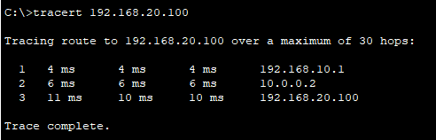
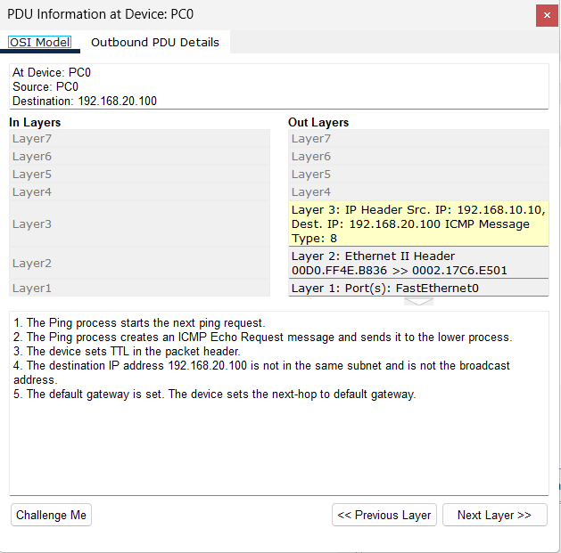
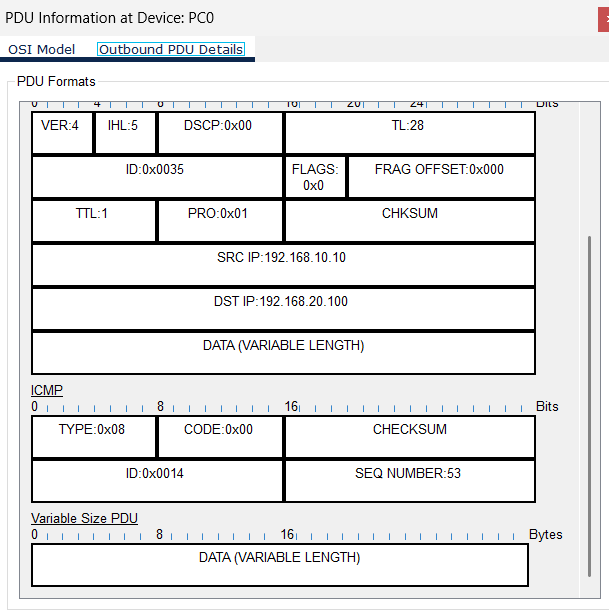
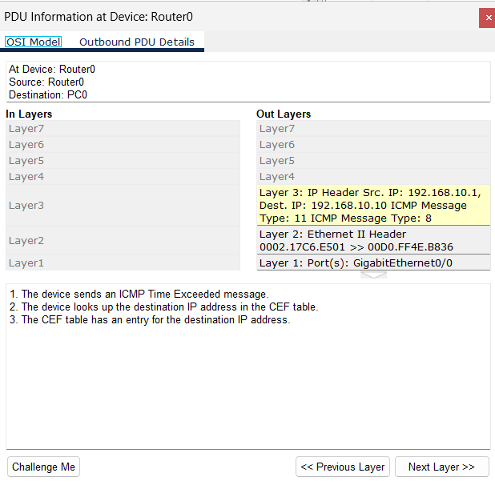
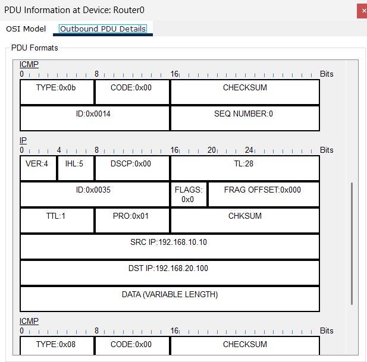
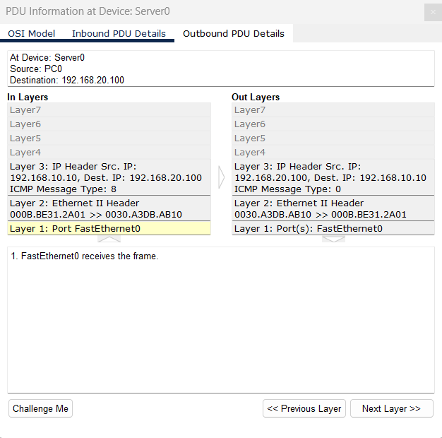
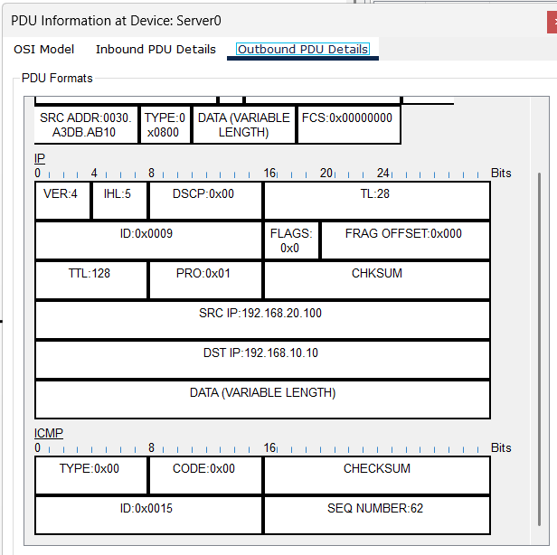

# W3 — ICMP & Traceroute (TTL & Hop) — Report

## 1) Goal
ICMP/TTL davranışını kanıtlamak:
- TTL her **router hop**'ında 1 azalır; TTL=0 olunca **ICMP Time Exceeded (Type 11 / 0x0B, Code 0)** döner.
- Hedefe ulaşıldığında **ICMP Echo Reply (Type 0 / 0x00)** alınır.
- PT PDU içinde **outer ICMP (11)** ile **encapsulated original ICMP (8)** farkını göstermek.

---

## Setup (Topology)
**Cihazlar:** R1 (2911), R2 (2911), SW-A (2960), SW-B (2960), PC-A, Server  
**Bağlantılar:**  
- PC-A(Fa0) ↔ SW-A(Fa0/2)  
- SW-A(Fa0/1) ↔ R1(Gi0/0)  
- R1(Gi0/1) ↔ R2(Gi0/0)  
- R2(Gi0/1) ↔ SW-B(Fa0/1)  
- Server(Fa0) ↔ SW-B(Fa0/2)

**IP Planı**
- **LAN-A**: R1 Gi0/0 = `192.168.10.1/24`  | PC-A = `192.168.10.10/24`, **DG `192.168.10.1`**
- **Transit**: R1 Gi0/1 = `10.0.0.1/30` | R2 Gi0/0 = `10.0.0.2/30`
- **LAN-B**: R2 Gi0/1 = `192.168.20.1/24` | Server = `192.168.20.100/24`, **DG `192.168.20.1`**

**Statik Rotlar**
- R1 → `ip route 192.168.20.0 255.255.255.0 10.0.12.2`
- R2 → `ip route 192.168.10.0 255.255.255.0 10.0.12.1`

---

## 2) Steps

### Router konfigürasyonu
**R1**
```text
enable
conf t
interface g0/0
 description LAN-A
 ip address 192.168.10.1 255.255.255.0
 no shut
interface g0/1
 description R1-R2 transit
 ip address 10.0.12.1 255.255.255.252
 no shut
ip route 192.168.20.0 255.255.255.0 10.0.12.2
end
write memory
````

**R2**

```text
enable
conf t
interface g0/0
 description R1-R2 transit
 ip address 10.0.12.2 255.255.255.252
 no shut
interface g0/1
 description LAN-B
 ip address 192.168.20.1 255.255.255.0
 no shut
ip route 192.168.10.0 255.255.255.0 10.0.12.1
end
write memory
```

**Doğrulama**

```text
show ip interface brief
show ip route
```

###  PC/Server IP ayarı

* **PC-A:** `192.168.10.11 / 255.255.255.0`, **DG `192.168.10.1`**
* **Server:** `192.168.20.22 / 255.255.255.0`, **DG `192.168.20.1`**

###  Bağlantı testi

* PC-A → `ping 192.168.20.22` (başarılı)
* (Ops) R1’den kaynaklı ping:

```text
R1# ping 192.168.20.22 source 192.168.10.1
```

### Traceroute (PC)

* PC-A **Command Prompt** → `tracert 192.168.20.22`
  **SS kaydet:** `diagrams/screen_w3_tracert.png`

### Simulation’da ICMP/TTL yakalama

* **Simulation** moda geç → **Edit Filters**: **IPv4** ve **ICMP** açık, diğerleri kapalı.
* **Event List → Clear**
* **Yöntem A (tracert ile):** `tracert 192.168.20.22`

  * Listede **router kaynaklı** olayları tıkla; **PDU Details**’ta **ICMP Type 11** beklenir.
* **Yöntem B (garanti – Complex PDU):**

  * Sol menü → **Add Complex PDU**
  * **Select Application:** `PING`
  * **Destination IP:** `192.168.20.22`
  * **Source IP:** boş bırak (oto) veya `192.168.10.11`
  * **TTL:** `1` → **Create PDU** (Hop-1’de **Type 11** dönecek)
  * **TTL:** `2` → **Create PDU** (Hop-2’de **Type 11**)
  * **TTL:** `3` → **Create PDU** (Hedefte **Type 0 Echo Reply**)
    **SS kaydet:** `diagrams/screen_w3_icmp-events.png` (en az bir **Type 11** ve bir **Type 0** PDU detayı)

### (Opsiyonel) Negatif senaryo — Unreachable

* R1’de rotayı kaldır:
  `conf t` → `no ip route 192.168.20.0 255.255.255.0 10.0.12.2` → `end`
* PC-A `tracert` → **Type 3 (Destination Unreachable)**/yıldızlar beklenir.
* Rotayı geri ekle.

---

## 3) Evidence (kanıt dosyaları)









---

## 4) Findings (bulgular)

* **TTL davranışı:** TTL her **router** hop’ında 1 azaldı; **TTL=0** olduğunda ara router **ICMP Time Exceeded** üretti.
* **ICMP türleri:**
  * **Type 11 (0x0B), Code 0** = *TTL exceeded in transit* (hop kimliği için kullanılır).
  * **Type 8 (0x08), Code 0** = *Echo Request* (giden probe).
  * **Type 0 (0x00), Code 0** = *Echo Reply* (hedef yanıtı).
* **Encapsulation:** ICMP hata mesajları, **orijinal IP başlığını + ilk 8 baytını** gömer → PDU’da aynı pakette **iki ICMP** satırı görünür (**outer=11**, **embedded=8**).
* **Hex ↔ Decimal eşlemesi:**
  **0x0B ≡ 11**, **0x08 ≡ 8**, **0x00 ≡ 0** (hex, 16’lık tabandır; B=11).

---

## 5) Notes

* **Switch hop değildir:** TTL yalnızca **router**’larda azalır..
* **Traceroute ≠ Ping:** `tracert` TTL’i 1’den başlatır; `ping` büyük TTL ile gider (genelde TTL bitmez).
* **Routerdan PC ye dönüşteki ICMP satırı :** Outer (11) + encapsulated original (8).

---

## DoD (Definition of Done)

* [ ] Topoloji kuruldu ve IP planı uygulandı
* [ ] PC-A ↔ Server **ping OK**
* [ ] `tracert 192.168.20.100` ekran görüntüsü eklendi
* [ ] Simulation’da en az **1× Type 11** (router→PC) ve **1× Type 0** (hedef→PC) PDU detayı SS eklendi
* [ ] Paket yorumu: TTL azalması, ICMP Type/Code açıklaması yazıldı
* [ ] (Ops) `show ip route` ekran görüntüsü eklendi

---

## Appendix — Hex ↔ Decimal Hızlı Tablo

|  Hex | Dec | ICMP Anlamı                      |
| ---: | --: | -------------------------------- |
| 0x00 |   0 | Echo Reply (Type 0), Code 0      |
| 0x03 |   3 | Destination Unreachable (Type 3) |
| 0x05 |   5 | Redirect (Type 5)                |
| 0x08 |   8 | Echo Request (Type 8)            |
| 0x0B |  11 | Time Exceeded (Type 11)          |

```

